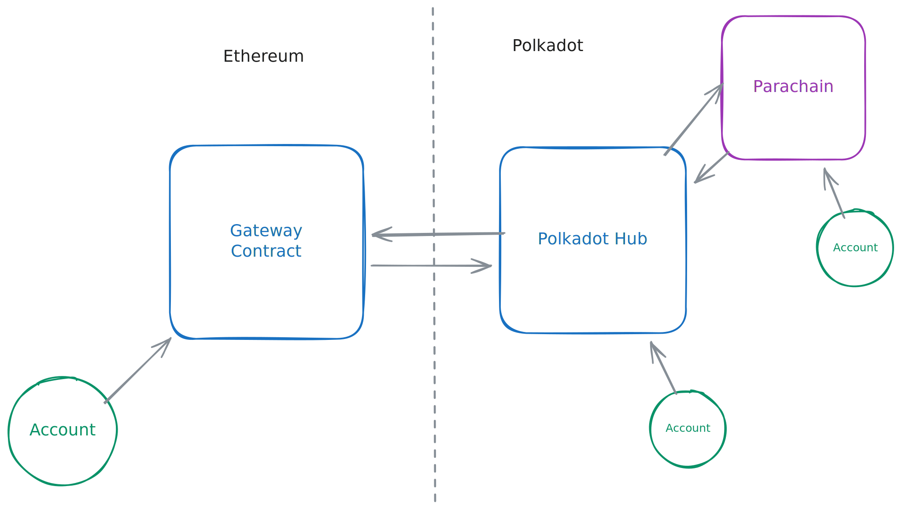

# Overview

Snowbridge provides a secure point-to-point bridge between Ethereum and the Polkadot Hub.

Users on Ethereum interact with our Gateway contract to either send tokens or generalised messages. After having received them, the Polkadot Hub can execute them locally, or in turn relay them to other parachains on Polkadot.

<figure><figcaption></figcaption></figure>
