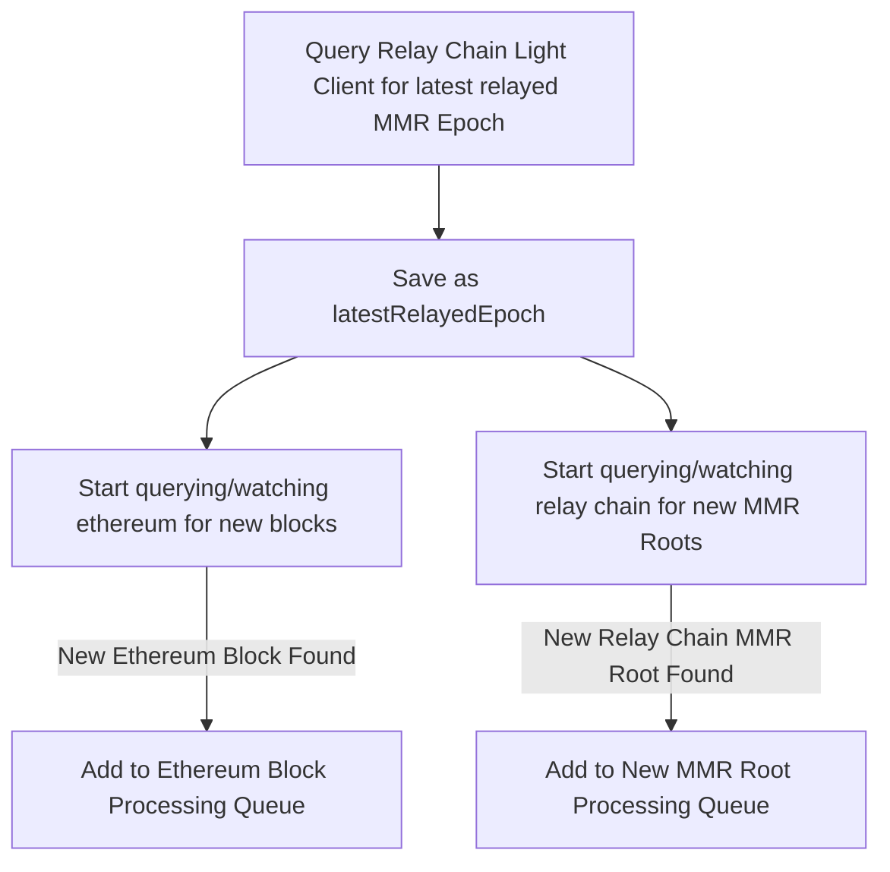
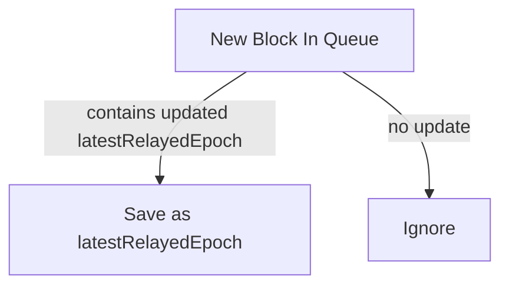
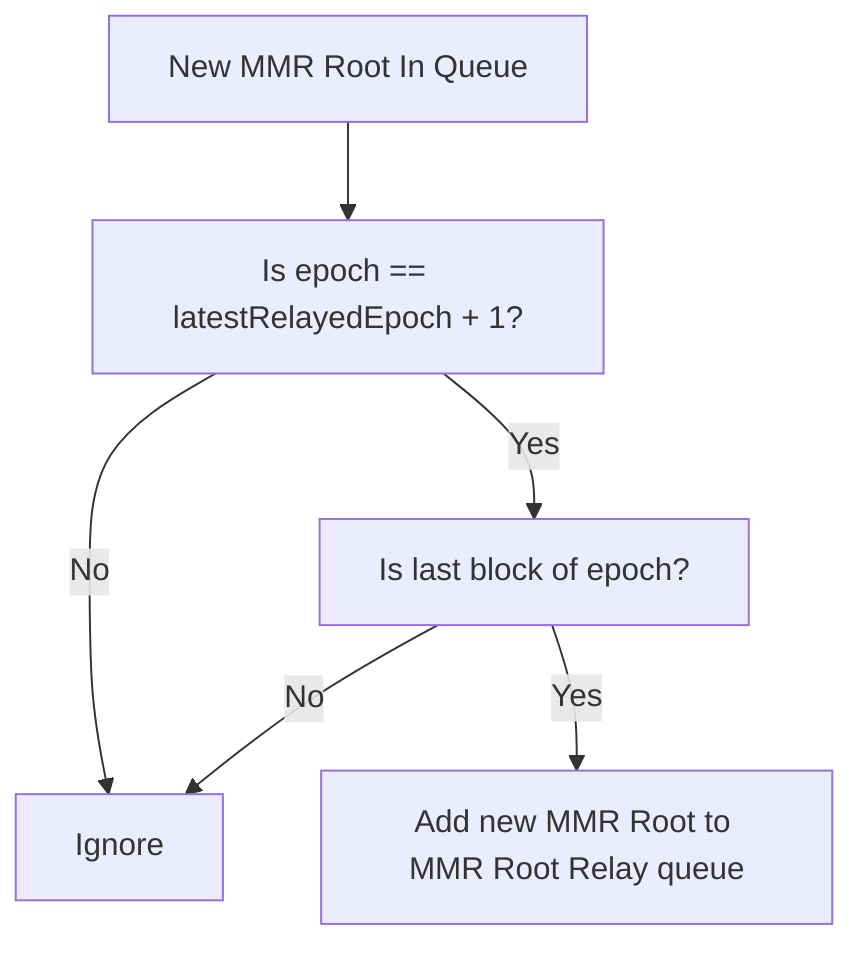
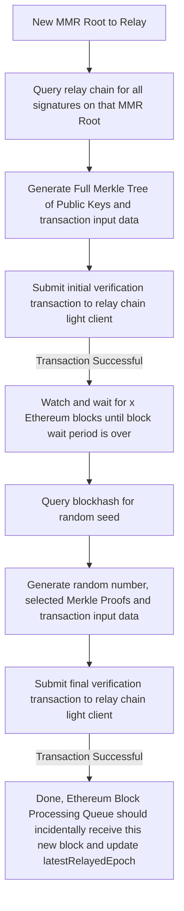
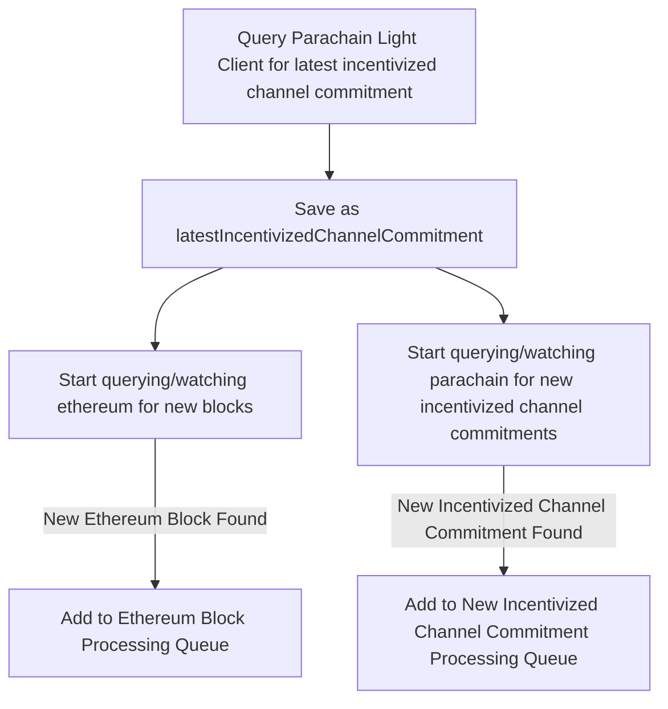
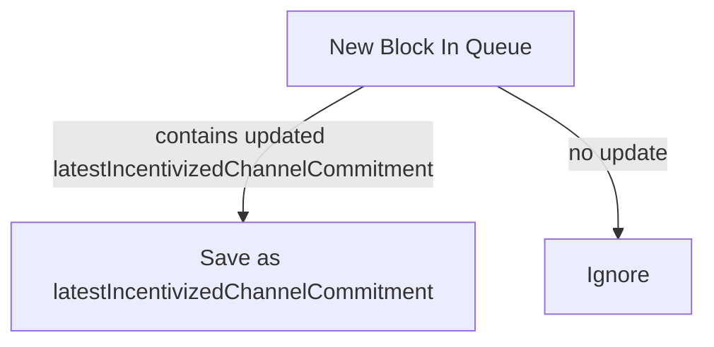
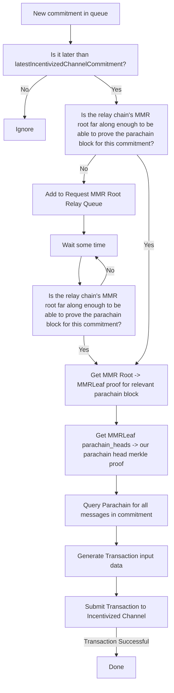
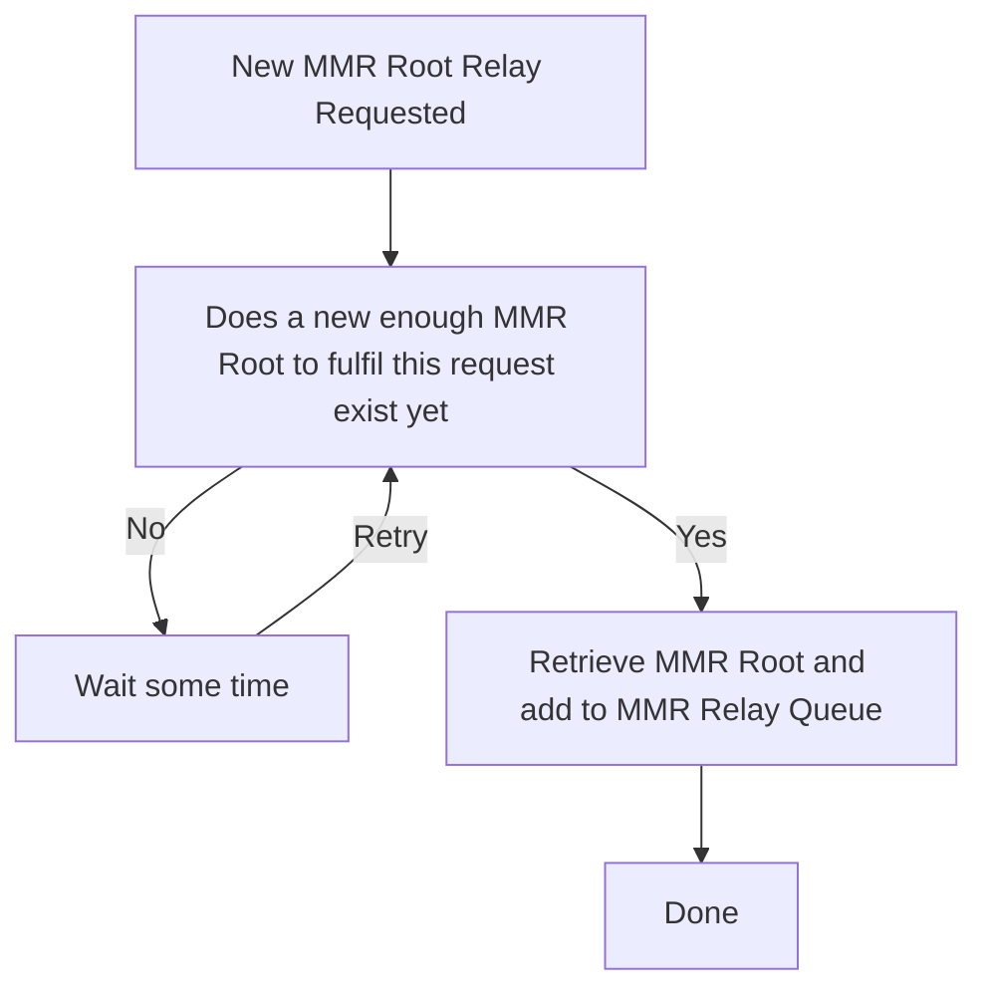

# Relayer Flow

## Polkadot to Ethereum
The relayer can be started in 2 different modes for relaying from Polkadot to Ethereum. Both can be run in parallel.

## MMR-Only mode
This mode runs the relayer in a mode where it ensures that the Ethereum contract receives MMR roots, where at least one MMR proof per epoch is guaranteed. It only interacts with the Relay Chain Light Client, not the Parachain Light Client.

### Relayer process starts in MMR-Epochs-Only mode

### Ethereum Block Processing Queue

### New MMR Root Processing Queue

### MMR Relay Queue

## Incentivized-Channel Mode
In this mode, the relayer watches for new incentivized channel commitments, ensuring that everything needed to process that commitment is relayed to Ethereum.
### Relayer process starts in Incentivized-Channel Mode

### Ethereum Block Processing Queue

### New Incentivized Channel Commitment Processing Queue

### Request MMR Relay Queue

### MMR Relay Queue
Same as in MMR-Epochs-Only mode
