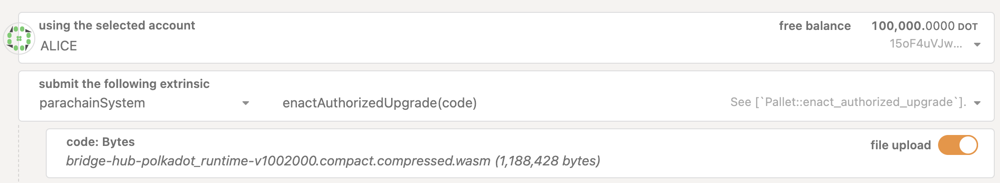

# Test Runtime Upgrades

## Overview

A scenario that frequently occurs is that we need to test a Snowbridge-related runtime upgrade that depends on a system parachain upgrade. Runtime upgrades for system parachains can take up to four weeks to execute. If we wait for the system parachain upgrade to complete first before initiating the Snowbridge upgrades, release cycles could take months.&#x20;

Therefore, it is useful to be able to test system parachain upgrades that have not yet executed and then apply Snowbridge upgrades to ensure everything works.

## Steps

In the following scenario, we will simulate execution of the 1.2.0 upgrade: https://github.com/polkadot-fellows/runtimes/releases/tag/v1.2.0.

1. Install [opengov-cli](https://github.com/joepetrowski/opengov-cli)
2. Build the preimage for the upgrade:

<pre class="language-sh"><code class="lang-sh"><strong>opengov-cli build-upgrade --network polkadot --relay-version 1.2.0 --filename preimage.hex
</strong></code></pre>

3. Convert the preimage from hex to binary

```sh
cd upgrade-polkadot-1.2.0 
xxd -r -p preimage.hex > preimage.bin
```

4. Determine the size of the of preimage, save as `PREIMAGE_SIZE`

On Linux:

```sh
$ stat -c%s preimage.bin
1567371
$ export PREIMAGE_SIZE=1567371
```

On Mac:

```sh
$ stat -f%z preimage.bin
1567371
$ export PREIMAGE_SIZE=1567371
```

5. Compute blake2-256 hash of preimage, save as PREIMAGE\_HASH

```sh
$ b2sum -l 256 preimage.bin | awk '{print "0x"$1}'
0x15165c85152568b7f523e374ce1a5172f2aa148721d5dae0441f86c201c1a77b4
$ export PREIMAGE_HASH=0x15165c85152568b7f523e374ce1a5172f2aa148721d5dae0441f86c201c1a77b4
```

6. Prepend compact-encoded length prefix to preimage, and convert back to hex, save as PREIMAGE\_WITH\_LENGTH\_PREFIX:

```rust
use codec::Encode;
use std::fs::File;

fn main() {
    let mut file = File::open("preimage.bin")?;
    let mut buf: Vec<u8> = Vec::new();
    file.read_to_end(&mut buf)?;
    let bytes_encoded = buf.encode();
    println!("0x{}", hex::encode(bytes_encoded));
}
```

7. Create a chopsticks configuration file for the Polkadot relay chain, substituting the values generated previously:&#x20;

`polkadot.yml`

```yaml
endpoint: wss://polkadot-rpc.dwellir.com
mock-signature-host: true
block: ${env.POLKADOT_BLOCK_NUMBER}
db: ./polkadot.sqlite

import-storage:
  System:
    Account:
      - - - 5GrwvaEF5zXb26Fz9rcQpDWS57CtERHpNehXCPcNoHGKutQY
        - providers: 1
          data:
            free: '10000000000000000000'
  ParasDisputes:
    $removePrefix: ['disputes'] # those can makes block building super slow
  Preimage:
    {
      PreimageFor:
        [[[[PREIMAGE_HASH, PREIMAGE_SIZE]], PREIMAGE_WITH_LENGTH_PREFIX]],
      StatusFor:
        [[[PREIMAGE_HASH], { Requested: { count: 1, len: PREIMAGE_SIZE } }]],
    }
```

8. Use these Chopstics config files for AssetHub and BridgeHub

`polkadot-asset-hub.yml`

```yaml
endpoint: wss://statemint-rpc.dwellir.com
mock-signature-host: true
block: ${env.POLKADOT_ASSET_HUB_BLOCK_NUMBER}
db: ./assethub.sqlite

import-storage:
  System:
    Account:
      - - - 5GrwvaEF5zXb26Fz9rcQpDWS57CtERHpNehXCPcNoHGKutQY
        - providers: 1
          data:
            free: 1000000000000000
```

`polkadot-bridge-hub.yml`

```yaml
endpoint: wss://polkadot-bridge-hub-rpc.dwellir.com
mock-signature-host: true
block: ${env.POLKADOT_BRIDGEHUB_BLOCK_NUMBER}
db: ./bridgehub.sqlite

import-storage:
  System:
    Account:
      - - - 5GrwvaEF5zXb26Fz9rcQpDWS57CtERHpNehXCPcNoHGKutQY
        - providers: 1
          data:
            free: 1000000000000000
```

9. Run Chopsticks

```sh
yarn start xcm -r polkadot.yml -p polkadot-asset-hub.yml -p polkadot-bridge-hub.yml
```

A verification step that can be performed to see if the preimage has been added successfully is to check the `preimage` storage in the chain state. The authorized preimage should be in the list of added preimages.

10. Execute the upgrade on the relay chain using Polkadot-JS:

```rust
const number = (await api.rpc.chain.getHeader()).number.toNumber()

await api.rpc('dev_setStorage', {
  Scheduler: {
    Agenda: [
      [
        [number + 1],
        [
          {
            call: {
              Lookup: {
                hash: PREIMAGE_HASH,
                len: PREIMAGE_SIZE,
              },
            },
            origin: {
              system: 'Root',
            },
          },
        ],
      ],
    ],
  },
})

await api.rpc('dev_newBlock', { count: 1 })
```

11. Advance a few blocks on the relay chain

```rust
await api.rpc('dev_newBlock', { count: 2 })
```

12. Advance by one block on bridgehub (not sure if necessary, need to experiment)

```rust
await api.rpc('dev_newBlock', { count: 1 })
```

13. Now that the upgrade has been authorized on BridgeHub, we can execute the upgrade by calling parachainSystem.enactAuthorizedUpgrade, passing the parachain WASM blob previously generated by opengov-cli:

<figure><figcaption></figcaption></figure>

14. Advance a few blocks on both bridgehub AND the relay chain

```rust
await api.rpc('dev_newBlock', { count: 1 })
```

15. The parachain should now be upgraded.

## Caveats

Some polkadot API endpoints aggressively timeout connections, causing Chopsticks to die: Comment

```sh
API-WS: disconnected from wss://polkadot-rpc.dwellir.com: 1006:: Abnormal Closure
```

The usual remedy is to restart chopsticks and pray the API connections don't die again.
