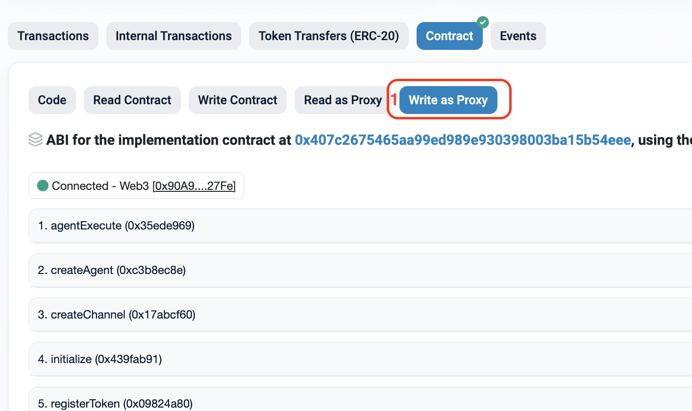
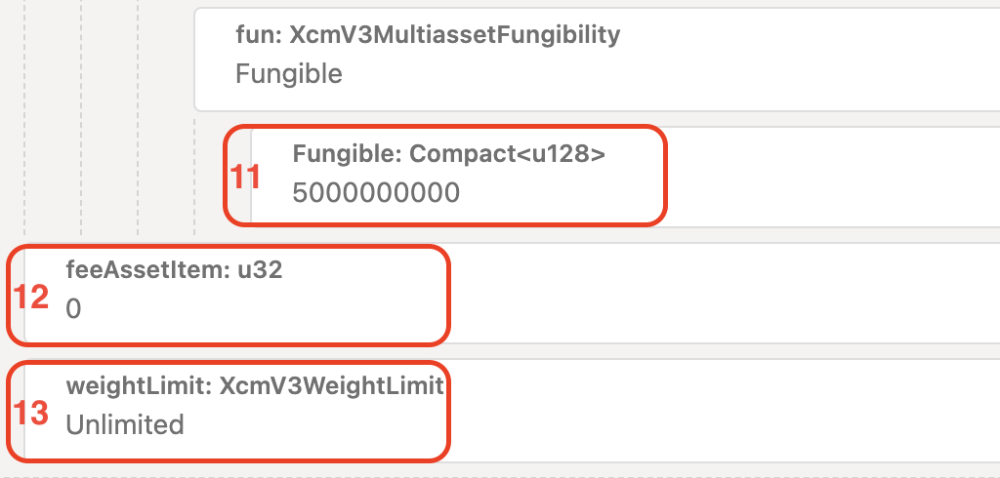

# Rococo-Sepolia Token Transfers

## Sending ERC20 tokens from Ethereum to Polkadot

### Sending tokens to Asset Hub

Snowbridge has initially only activated support for the sending of ERC20 tokens to Polkadot. To send Ether to Polkadot you can use [WETH](https://sepolia.etherscan.io/address/0xfFf9976782d46CC05630D1f6eBAb18b2324d6B14) (Wrapped ETH). To register your own ERC20 tokens see [Registering Tokens](rococo-sepolia-token-transfers.md#registering-tokens).

#### 1. Deposit ETH

If you already have [WETH](https://sepolia.etherscan.io/address/0xfFf9976782d46CC05630D1f6eBAb18b2324d6B14) you can skip this step. If not go to the [WETH](https://sepolia.etherscan.io/address/0xfFf9976782d46CC05630D1f6eBAb18b2324d6B14) contract and make a deposit.

WETH Contract Address: [0xfFf9976782d46CC05630D1f6eBAb18b2324d6B14](https://sepolia.etherscan.io/address/0xfFf9976782d46CC05630D1f6eBAb18b2324d6B14)

1. Click on the Contracts tab.
2. Click on the Write Contract tab.
3. Connect your wallet.
4. Enter 5 Gwei (0.000000005 Ether).
5. Click the write button and sign the transaction using your wallet.

<figure><figcaption></figcaption></figure>

#### 2. Approve Snowbridge as a spender for your WETH

Snowbridge needs to be an approved spender for you to send tokens to Polkadot.

WETH Contract Address: [0xfFf9976782d46CC05630D1f6eBAb18b2324d6B14](https://sepolia.etherscan.io/address/0xfFf9976782d46CC05630D1f6eBAb18b2324d6B14)

Navigate to the Contract tab, click on Write Contract, and connect your wallet.

1. Enter Snowbridge’s Gateway contract as the `guy` (spender) parameter. Gateway Contract Address: [0x5b4909ce6ca82d2ce23bd46738953c7959e710cd](https://sepolia.etherscan.io/address/0x5b4909ce6ca82d2ce23bd46738953c7959e710cd)
2. Enter the amount that Snowbridge can spend as the `wad` parameter. In this example, we have used 5 Gwei (5000000000 Wei).

<figure><figcaption></figcaption></figure>

#### 3. Creation of an Account on Asset Hub

You can now send [WETH](https://sepolia.etherscan.io/address/0xfFf9976782d46CC05630D1f6eBAb18b2324d6B14) to Polkadot using the Snowbridge Gateway. Assets are held in reserve on the [Asset Hub](https://polkadot.js.org/apps/?rpc=wss%3A%2F%2Frococo-asset-hub-rpc.polkadot.io#/explorer).

To send [WETH](https://sepolia.etherscan.io/address/0xfFf9976782d46CC05630D1f6eBAb18b2324d6B14) to a `beneficiary` account it must have at least an existential deposit of `0.000033333333` ROC on Asset Hub. Before transfer, you will first need to teleport assets to the Asset Hub. This step only needs to be done once per beneficiary.

1. Go Polkadot.js web interface’s [extrinsic screen](https://polkadot.js.org/apps/?rpc=wss%3A%2F%2Frococo-rpc.polkadot.io#/extrinsics) for the Rococo relaychain. Click on the Decode tab.
2. Paste in the encoded call. This call will send `0.0001` ROC to parachain 1000 (Asset Hub) which will cover the existential deposit and fees for the transfer.

```bash
0x630b03000100a10f030001010000000000000000000000000000000000000000000000000000000000000000000304000000000284d7170000000000
```

3. Click on the Submission tab where you can now edit the call further. You will want to change the `beneficiary` to point to the account of your choice. In this example, we will use account `5Gn12Tq1ndABBJrym2uzNoeGRcBgTRRSviLnSajVxqka4mfX`.

<figure><figcaption></figcaption></figure>

4. Sign and submit the transaction.
5. Go Polkadot.js web interface’s [chain state screen](https://polkadot.js.org/apps/?rpc=wss%3A%2F%2Frococo-asset-hub-rpc.polkadot.io#/chainstate) for Asset Hub. Click on the storage tab and query state `system.account` to check if your funds were successfully teleported.

<figure><figcaption></figcaption></figure>

#### 4. Checking the Required Fee

Get a quote for the fee required to send a token.

Gateway Contract Address: [0x5b4909ce6ca82d2ce23bd46738953c7959e710cd](https://sepolia.etherscan.io/address/0x5b4909ce6ca82d2ce23bd46738953c7959e710cd)

1. Navigate to the Contract tab, click Read as Proxy.
2. Expand `quoteSendTokenFee` and input the token address.
3. The destination address is `1000` for Asset Hub.
4. The `destinationFee` is always 0 for transfers to Asset Hub.
5. Click query, the fee is returned in the unit `Wei`.

<figure><figcaption></figcaption></figure>

#### 5. Send WETH to Polkadot

With the `beneficiary` account set up on Asset Hub and the required fees queried, we can now send [WETH](https://sepolia.etherscan.io/address/0xfFf9976782d46CC05630D1f6eBAb18b2324d6B14).

Gateway Contract Address: [0x5b4909ce6ca82d2ce23bd46738953c7959e710cd](https://sepolia.etherscan.io/address/0x5b4909ce6ca82d2ce23bd46738953c7959e710cd)

Navigate to the Contract tab and connect your wallet.

1. This time we will select the Write as Proxy tab.

<figure><figcaption></figcaption></figure>

2. Expand `sendToken`.
3. The bridge charges a fee of `0.0000005` Ether for message delivery. This is the value returned from `[quoteRegisterTokenFee](https://www.notion.so/Rococo-Sepolia-User-Docs-4fc668649a094246aa909ba16d59ac51?pvs=21)`.
4. `token` is the address of the ERC20 token contract. In this example, it is the [WETH](https://sepolia.etherscan.io/address/0xfFf9976782d46CC05630D1f6eBAb18b2324d6B14) token contract.
5. `destinationChain` is the parachain id of the destination. In this example, it is 1000 (Asset Hub).
6. `destinationAddress.kind` is the type of address that the destination accepts. In our example, the destination is Asset Hub, which accepts kind `AddressId32` (value = 1).
7. `destinationAddress.data` is the `AccountId32`(public key hex) for the `beneficiary` we set up on Asset Hub. To get the public key hex you can use subkey cli or this [handy website](https://www.shawntabrizi.com/substrate-js-utilities/)’s **AccountId to Hex** tool.

```bash
$ subkey inspect 5Gn12Tq1ndABBJrym2uzNoeGRcBgTRRSviLnSajVxqka4mfX
```

8. The `destinationFee` is always 0 for transfers to Asset Hub.
9. `amount` is how much Ether we want to send in Wei. In this example, we are sending 5 Gwei (5000000000 Wei).

<figure><figcaption></figcaption></figure>

The transfer process takes about ±30 minutes to get to the other side of the bridge. You can query the beneficiary account to see if the transfer is successful.

1. Go Polkadot.js web interface’s [chain state screen](https://polkadot.js.org/apps/?rpc=wss%3A%2F%2Frococo-asset-hub-rpc.polkadot.io#/chainstate) for the Asset Hub. Click on the storage tab.
2. You want to query the `foreignAssets.account(XcmV3MultiLocation, AccountId32)` key. Bridged assets are identified by their Multilocation relative to Asset Hub.

```bash
../../GlobalConsensus(Ethereum{chain_id:11155111})/AccountKey20([0xfFf9976782d46CC05630D1f6eBAb18b2324d6B14](https://sepolia.etherscan.io/address/0xfFf9976782d46CC05630D1f6eBAb18b2324d6B14))
```

3. Two parents up.
4. Ethereum chain 11155111 for Sepolia.
5. The token address. In this example, it is the [WETH](https://sepolia.etherscan.io/address/0xfFf9976782d46CC05630D1f6eBAb18b2324d6B14) contract address.
6. The `beneficiary` account from above to query.

<figure><figcaption></figcaption></figure>

7. When the transfer is complete the amount will appear in the storage query.

<figure><figcaption></figcaption></figure>

### Sending Tokens to a User-specified Destination Parachain

Snowbridge supports sending tokens to a user-specified destination parachain. When specifying a destination chain the funds are transfered to Asset Hub and then a reserve transfer is done from Asset Hub to the destination parachain.

#### 1. Destination Parachain Requirements

1. An HRMP channel needs to exist between Asset Hub and the parachain.
2. The parachain chain needs to support XCM v3.
3. The parachain must support the relaychain native currency(`ROC`) as payment for XCM execution.
4. The parachain must have a funded sovereign account on Asset Hub with an existential deposit of `0.000033333333` ROC.
5. The parachain needs to be configured to allow assets from AssetHub to be used as reserve assets. See [Penpal XCM config](https://github.com/paritytech/polkadot-sdk/blob/2fe3145ab9bd26ceb5a26baf2a64105b0035a5a6/cumulus/parachains/runtimes/testing/penpal/src/xcm\_config.rs#L319).
6. The asset being transferred needs to be registered with the destination parachain. This is dependent on the chain itself.
   1. ORML based parachains require the asset to be registered in `asset-registry` pallet before transfer. Example runtime config:
      1. [Snowbridge ORML Template](https://github.com/Snowfork/parachain-orml-template/blob/2cac336b000ac869bcc95a1326d4279fc47f6daa/runtime/src/lib.rs#L497-L541).
   2. `pallet-assets` - An instance of the `pallet-assets` can be added to store foreign assets. The asset needs to be created with `create` extrinsic before transfer. Examples runtime config:
      1. [Penpal Asset Transactor](https://github.com/paritytech/polkadot-sdk/blob/2fe3145ab9bd26ceb5a26baf2a64105b0035a5a6/cumulus/parachains/runtimes/testing/penpal/src/xcm\_config.rs#L150).
      2. [Penpal Foreign Assets Pallet](https://github.com/paritytech/polkadot-sdk/blob/2fe3145ab9bd26ceb5a26baf2a64105b0035a5a6/cumulus/parachains/runtimes/testing/penpal/src/lib.rs#L471-L493).
   3. &#x20;`pallet-balances` - A currency adapter can be added to convert a MultiLocation from an Ethereum Asset to the local parachain currency. Examples runtime config:
      1. [Trappist Parachain Currency Adapter](https://github.com/paritytech/trappist/blob/2ed4e954eb5840365c15d200d915205e71e93525/runtime/trappist/src/xcm\_config.rs#L119-L130).

#### 2. Before Performing the Transfer

Most of the steps will be the same as the pre-transfer steps are the same as [sending tokens to Asset Hub](rococo-sepolia-token-transfers.md#sending-tokens-to-asset-hub).

1. The token needs to be [registered on Asset Hub](rococo-sepolia-token-transfers.md#registering-tokens).
2. You will need to [deposit ETH to get WETH](rococo-sepolia-token-transfers.md#id-1.-deposit-eth).
3. The Snowbridge Gateway will need to be an[ approved spender](rococo-sepolia-token-transfers.md#id-2.-approve-snowbridge-as-a-spender-for-your-weth).
4. The `beneficiary` account must have at least an existential deposit of a sufficient asset on the destination chain to exist and receive tokens. The sufficient asset and existential deposit depend on the destination chain. See the [Asset Hub example](rococo-sepolia-token-transfers.md#id-3.-creation-of-an-account-on-asset-hub).

#### 3. Checking the Required Fee

Get a quote for the fee required to send a token.

Gateway Contract Address: [0x5b4909ce6ca82d2ce23bd46738953c7959e710cd](https://sepolia.etherscan.io/address/0x5b4909ce6ca82d2ce23bd46738953c7959e710cd)

1. Navigate to the Contract tab, click Read as Proxy.
2. Expand `quoteSendTokenFee` and input the token address.
3. The `destinationChain` that the token is going to be sent to. In this example it is destination parachain `2005`.
4. The `destinationFee` is the fee used by the destination chain to pay for XCM execution. This amount in the unit of the relaychain native currency. Here we use `1,000,000 ROC CENTS` . (`1 MircroROC`)
5. Click query, the fee is returned in the unit `Wei`.

<figure><figcaption></figcaption></figure>

#### 4. Sending the token

You can now send the token just like [sending to Asset Hub](rococo-sepolia-token-transfers.md#sending-tokens-to-asset-hub) with the following changes.

1. Add the fee [returned from quote](rococo-sepolia-token-transfers.md#id-3.-checking-the-destination-required-fee). In this example it is `0,000000500025` Ether.
2. Set the `destinationChain` to 2005.
3. Supply the `destinationFee` that was [provided to the quote](rococo-sepolia-token-transfers.md#id-3.-checking-the-required-fee). Here we use `1,000,000 ROC CENTS` . (`1 MircroROC`)

<figure><figcaption></figcaption></figure>

### Sending tokens to Parachains which support 20-byte Addresses (EVM based chains)

If the destination chain supports 20 byte addresses they can be provided using the following parameters:

1. Set the address `kind` to `2` for 20 byte address.
2. Set the address `data` to the 20 byte address.

<figure><figcaption></figcaption></figure>

### Registering Tokens

Any ERC20 token can be registered for use with Snowbridge in a single step.

Gateway Contract Address: [0x5b4909ce6ca82d2ce23bd46738953c7959e710cd](https://sepolia.etherscan.io/address/0x5b4909ce6ca82d2ce23bd46738953c7959e710cd)

#### 1. Checking the Required Fee

Get a quote for the fee required to register a token. Navigate to the Contract tab, click Read as Proxy.

1. Click Read as Proxy.
2. Expand `quoteRegisterTokenFee`. This fee is returned in the unit `Wei`.

<figure><figcaption></figcaption></figure>

#### 2. Register

Navigate to the Contract tab, click on Write as Proxy, and connect your wallet.

1. Expand `registerToken`.
2. The bridge charges a fee returned by the `quoteRegisterTokenFee` call for message delivery and token creation. This fee returned by this call is in unit Wei. The fee accepted by the `registerToken` call must be passed in unit Ether.
3. Enter ERC20 token address.
4. Click on the Write button and verify the transaction was processed without revert.

<figure><figcaption></figcaption></figure>

This will queue a message to register the asset on Asset Hub. The transfer process takes about ±30 minutes to get to the other side of the bridge. To confirm the creation of your token as an asset in AssetHub.

1. Go Polkadot.js web interface’s [chain state screen](https://polkadot.js.org/apps/?rpc=wss%3A%2F%2Frococo-asset-hub-rpc.polkadot.io#/chainstate) for Asset Hub. Click on the storage tab.
2. You want to query the `foreignAssets.asset(XcmV3MultiLocation)` key. Bridged assets are identified by their [Multilocation relative to Asset Hub](https://www.notion.so/Rococo-Sepolia-User-Docs-4fc668649a094246aa909ba16d59ac51?pvs=21).
3. Two parents up.
4. Ethereum chain 11155111 for Sepolia.
5. The token address that you registered. In this example, it is the [WETH](https://sepolia.etherscan.io/address/0xfFf9976782d46CC05630D1f6eBAb18b2324d6B14) contract address.

<figure><figcaption></figcaption></figure>

6. When the registration is complete the asset will appear in the storage query with a supply of 0 and 0 accounts. Use [Send Token ](rococo-sepolia-token-transfers.md#sending-tokens)to transfer some of your tokens to mint it on Asset Hub.

<figure><figcaption></figcaption></figure>

## Sending ERC20 tokens from Polkadot to Ethereum

#### 1. Send Tokens back to Polkadot

Tokens are held in the [Asset Hub](https://polkadot.js.org/apps/?rpc=wss%3A%2F%2Frococo-asset-hub-rpc.polkadot.io#/explorer). You can send ERC20 tokens back across the bridge from there.

1. Go to the Polkadot.js web interfaces [extrinsics screen](https://polkadot.js.org/apps/?rpc=wss%3A%2F%2Frococo-asset-hub-rpc.polkadot.io#/extrinsics) for Asset Hub. Click on the Decode tab.
2. Paste in the encoded call. This call with transfer 5 Gwei (5000000000 Wei) of [WETH](https://sepolia.etherscan.io/address/0xfFf9976782d46CC05630D1f6eBAb18b2324d6B14) to `the` destination Ethereum address `0x0000000000000000000000000000000000000000` using the `bridgeTransfer.transferAssets(dest, beneficiary, assets, feeAssetItem, weightLimit)` extrinsic.

```bash
0x1f0b03020109079edaa80203000103000000000000000000000000000000000000000000030400020209079edaa8020300fff9976782d46cc05630d1f6ebab18b2324d6b14000700f2052a010000000000
```

3. Click on the Submission tab where you can now edit the call further.
4. Select the account you want to transfer [WETH](https://sepolia.etherscan.io/address/0xfFf9976782d46CC05630D1f6eBAb18b2324d6B14) from. In this example, we will use the account `5Gn12Tq1ndABBJrym2uzNoeGRcBgTRRSviLnSajVxqka4mfX`.
5. Select the `dest`. Two parents up.
6. Ethereum chain `11155111` for Sepolia.

<figure><figcaption></figcaption></figure>

7. You will want to change the `beneficiary` Mulitlocation to point to the account of your choice. In this example, we will use the Ethereum account `0xFeAd9f6EAC9A616C8CCa1161bff792dd79093A0f`.

<figure><figcaption></figcaption></figure>

8. Specify the parents for the `asset`. Two parents up.
9. Specify the Ethereum chain id for the destination. Ethereum chain 11155111 for Sepolia.
10. The token address. In this example, it is the [WETH](https://sepolia.etherscan.io/address/0xfFf9976782d46CC05630D1f6eBAb18b2324d6B14) contract address.

<figure><figcaption></figcaption></figure>

11. The amount of the token you want to send. In the example, 5 Gwei (5000000000 Wei).
12. Select 0 as the fee asset item to use on the destination. This means that WETH is used as a fee item. However, Snowbridge does not charge fees on the destination, so no fees will be deducted with WETH. A fee will be charged on the ROC on assethub for the transfer. There is no simple way to get a quote fee currently. You should have a balance of atleast 3 ROC before you attempt to transfer.
13. Use unlimited weight for the transfer.

<figure><figcaption></figcaption></figure>

14. Sign and submit the transaction. Ensure that it executions without errors by checking its status in the block.

<figure><figcaption></figcaption></figure>

The transfer process takes about ±45 minutes to get to the other side of the bridge. You can verify by searching at the destination address in [Etherscan](https://sepolia.etherscan.io/). In this example, we used the Ethereum address `[0xFeAd9f6EAC9A616C8CCa1161bff792dd79093A0f](https://sepolia.etherscan.io/address/0xFeAd9f6EAC9A616C8CCa1161bff792dd79093A0f)`.

1. Select the token transfers tab.
2. View the transfer transaction. The source method will `SubmitV1` which means it came from the Snowbridge Gateway contract.

<figure><figcaption></figcaption></figure>

1. You can also verify using your wallet. In MetaMask we can see our 5 Gwei has arrived.

<figure><figcaption></figcaption></figure>
